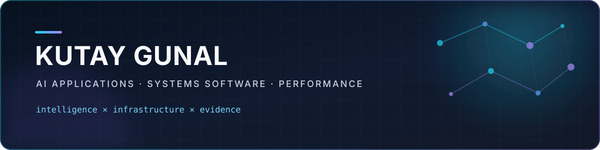

<div align="center">
  
</div>

# Hi, I'm Kutay.

I'm **Kutay Gunal** (`@kutaygunal`), a Lead Software Engineer building at the
intersection of **AI applications**, **systems software**, and **performance
engineering**.

I like problems with sharp edges: unsafe inputs, large datasets, hardware
constraints, operational failure modes, and software that has to explain *why*
it reached a result. My work moves between Rust, modern C++, CUDA, Python, and
product engineering—but the goal stays the same: turn a difficult system into
something measurable, dependable, and useful.

<p align="center">
  <a href="https://www.linkedin.com/in/kutaygunal/"></a>
  <a href="https://github.com/kutaygunal?tab=repositories"></a>
  <a href="https://github.com/kutaygunal/kzip"></a>
</p>

## What I'm building

| Project | What makes it interesting |
| --- | --- |
| **[kzip](https://github.com/kutaygunal/kzip)** | Fast, memory-safe ZIP infrastructure for Rust and C, with async reads, encryption, differential verification, fuzzing, and a libzip-shaped ABI. |
| **[LodeStar](https://github.com/kutaygunal/LodeStar)** | A C++ GNSS/SBAS integration, test, and verification platform spanning scenario generation, safety analysis, and certification-ready reporting. |
| **[AEGIS-PERC](https://github.com/kutaygunal/AEGIS-PERC)** | An electrical-rule verification and semiconductor signoff platform with graph analysis, regression gating, and audit-ready workflows. |
| **[CSV-Arrow-Parser](https://github.com/kutaygunal/CSV-Arrow-Parser)** | A CUDA/C++ CSV-to-columnar parser with warp-level parsing and fused filter pushdown to avoid materializing discarded rows. |
| **[PatchOrchestrator](https://github.com/kutaygunal/PatchOrchestrator)** | A multi-layer control plane for planning, supervising, pausing, and recovering fleet-wide software patch rollouts. |
| **[Healthcare Revenue Risk Predictor](https://github.com/kutaygunal/healthcare-revenue-risk-predictor)** | A PyTorch system combining structured claims and clinical text to predict denial risk and missed billing opportunities. |

## The engineering loop I trust

```text
understand the failure mode
          ↓
model the system and its constraints
          ↓
make behavior observable
          ↓
test against reality, not assumptions
          ↓
ship → measure → refine
```

That usually means typed boundaries, deterministic tests, reproducible
benchmarks, useful failure messages, and documentation that says what is *not*
supported as clearly as what is.

## Toolbox

```text
Systems       Rust · C++17/20 · C · CUDA
AI & data     Python · PyTorch · computer vision · local LLM integration
Product       Qt · Swift/SwiftUI · C#/.NET · FastAPI
Quality       CI/CD · fuzzing · differential testing · benchmarking
Domains       developer tools · aerospace verification · semiconductors · healthcare
```

## Also exploring

Not every useful idea needs to become infrastructure. I also build experiments
in mobile health, games, visualization, and developer utilities. You can find
those in my [repositories](https://github.com/kutaygunal?tab=repositories).

## Let's build something rigorous

I'm building more of my work in public and welcome thoughtful collaboration.
If a project overlaps with your work, open an issue with the use case, the
failure mode, or the benchmark you care about. Specific problems make the best
starting points.

<div align="center">
  <sub>Curiosity starts the project. Evidence earns the confidence.</sub>
</div>

